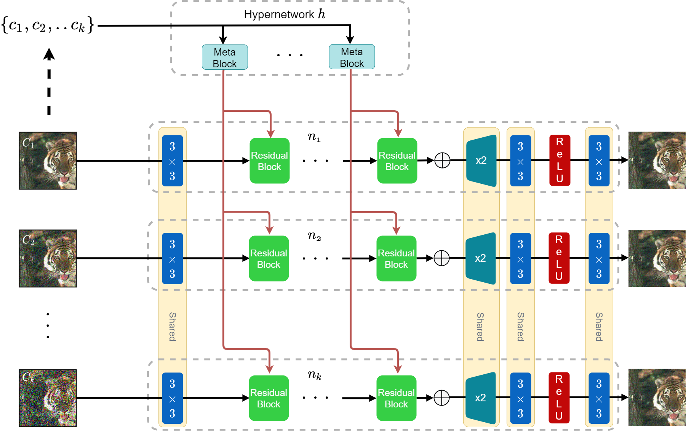
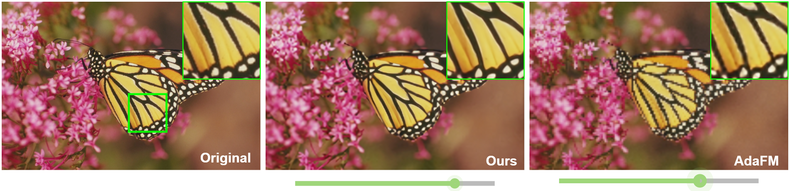
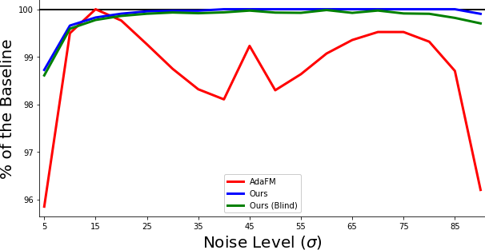

# HyperRes: Hypernetwork-Based Adaptive Image Restoration (ICASSP 2023)
by [Shai Aharon](https://www.linkedin.com/in/shai-aharon-b4495273/) and [Dr. Gil Ben-Artzi](http://www.gil-ba.com/)

<div align="center">

[](https://arxiv.org/abs/2206.05970)

  Official Implementation: **Hypernetwork-Based Adaptive Image Restoration** 
</div>  
   	

<p align="center">

</p>
Adaptive image restoration models can restore images with
different degradation levels at inference time without the need
to retrain the model. We present an approach that is highly
accurate and allows a significant reduction in the number of
parameters. In contrast to existing methods, our approach can
restore images using a single fixed-size model, regardless of
the number of degradation levels. On popular datasets, our
approach yields state-of-the-art results in terms of size and
accuracy for a variety of image restoration tasks, including
denoising, deJPEG, and super-resolution.

<p align="center">

</p>


This allows the user to continuoesly select the level of restoration without retraining
<p align="center">

</p>

For evaluation, we compared our method to 18 different networks, each has been separately 
trained on a single noise level from 5 to 90. Those networks determine the maximum accuracy that a network with similar 
architecture could achieve.
Our method surpasses _SOTA_ results, and achieves a near optimal accuracy on all the range, evan on extrapolation.

The graph below, compares our method and STOA methods to the optimal accuracy (the zero line).

<p align="center">

</p>


## Colab Demo
 [](https://colab.research.google.com/github/ifryed/HyperRes/blob/master/notebooks/HyperRes_demo.ipynb)
## Requirements
<details>

### Dependency

Our code is based on <a href="https://pytorch.org/get-started/locally/">
* PyTorch 1.5.11+

Run the following command line to install all the dependencies


    pip install -r requirements.txt

### Dataset

We used the DIV2K dataset for training all tasks. For evaluation, we used 
a different dataset for each task, in compliance to the common benchmarks, as follows.

| Task              | Dataset   | Comments                                              |
| ----------------- | --------- | ----------------------------------------------------- |
| Training			| DIV2K		| Used to train all tasks								|
| DeNoising         | BDSD68    | Trained and tested on RGB                             |
| DeJPEG            | LIVE1     | Trained and tested on Luminance (grayscale)           |
| Super-Resolution  | Set5      | Trained on RGB and tested on Luminance (grayscale)    |

Links:
- [DIV2K](https://data.vision.ee.ethz.ch/cvl/DIV2K/)
- [CBSD68](https://www2.eecs.berkeley.edu/Research/Projects/CS/vision/bsds/)
- [LIVE1](https://live.ece.utexas.edu/research/quality/subjective.htm)
- [Set5](http://people.rennes.inria.fr/Aline.Roumy/results/SR_BMVC12.html)
</details>

## Pre-trained Models
<details>

### We supply pre-trained models for each task

| Task              | Levels                | Link                                      |
| -------------     | --------------------- | ----------------------------------------- |
| DeNoising         | [15,35,55,75]         | [Link](pre_trained/noise_4.pth)           |
| Super Resolution  | [2,3,4,5]             | [Link](pre_trained/sr_4.pth)              |
| DeJPEG            | [10,30,50,80]         | [Link](pre_trained/jpeg_4_color.pth)      |
| Noise Detection   | 0-100                 | [Link](pre_trained/noise_detect.pth)      |
</details>

## Training
<details>

### Dataset File structure
To train/test the dataset should be defined as follows:

```
[main folder]─┐
              ├─► train ──┐
              │           ├─► n_10 ──┐
              ├─► valid   │          ├─► *.png
              │           ├─► n_15   │
              └─► test    │          ├─► *.png
                          .          │
                          .          │
                          .          │
                          .          │
                          .          └─► *.png
                          │
                          ├─► n_90
                          │
                          └─► clean

```

- The structure for the valid/test folder is the same as train.
- 'n' is for DeNoising, 'j' is used for DeJPEG and 'sr' for Super Resolution
- [n/j/sr]_[Number] is the corruption folders, the letters represent the task, and the number is the corruption level.
- The images name in the 'clean' folder should mirror the names in the corruption folders


Train command:
```shell
python train_main.py       \
        --data [path to data]   \
        --data_type [n,sr,j]    \
        --lvls 15 35 50 75      \
        --checkpoint [SavePath] \
        --device [cpu/cuda]     \       
        --no_bn                 
```

</details>

## Testing

<details>

```shell
python test_main.py                          \
        --data [path to data]                     \ 
        --data_type [n,sr,j]                      \
        --lvls [15 45 75]                         \
        --valid [test folder inside data]         \                              
        --weights [path to weights file (*.pth)]  \ 
        --device [cpu/cuda]                       \
        --no_bn
```
</details>

## Live Demo
<details>

```shell
python live_demo.py                                       \
        --input [Path to image folder or image]           \
        --data_type [n,sr,j]                              \
        --checkpoint [Path to weights file (*.pth)]       \ 
        --no_bn 
```
</details>

## Citation
If you find either the code or the paper useful for your research, please cite our paper:

```
@misc{https://doi.org/10.48550/arxiv.2206.05970,
  doi = {10.48550/ARXIV.2206.05970},  
  url = {https://arxiv.org/abs/2206.05970},  
  author = {Aharon, Shai and Ben-Artzi, Gil},    
  title = {HyperRes: Hypernetwork-Based Adaptive Image Restoration},  
  publisher = {ICASP},  
  year = {2023},  
  copyright = {Creative Commons Attribution Non Commercial No Derivatives 4.0 International}
}
```
